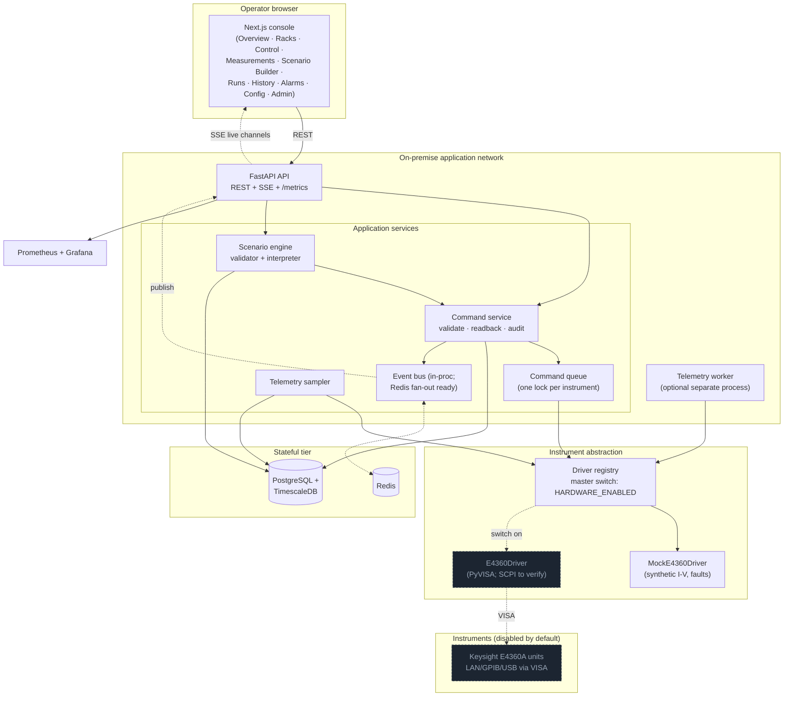

# Architecture — Solar Array Simulator Control Platform

This document covers deliverables 1–3: the architecture and explicit
assumptions, the technology selection with justification, and the system
diagram.

## 1. Purpose and scope

The platform is an **on-premise, safety-aware web application** to monitor and
control a fleet of Keysight E4360A Solar Array Simulator (SAS) units over SCPI.
It is built so the entire system runs today against a **mock instrument layer**,
with real hardware kept behind a single master switch that is **off by default**.

Everything the operator sees is labelled **SIMULATION MODE** until that switch
is deliberately flipped. The application is the system of record for *who did
what to which instrument, when, and what the instrument reported back*.

### Explicit assumptions

- **One logical unit = one controllable endpoint.** A unit may map to a rack, a
  mainframe, a slot/module, or an output channel. The seed data maps units to
  output channels of E4360A modules, which is the common case.
- **Serial command discipline per instrument.** A physical mainframe tolerates
  only one outstanding command at a time. The platform enforces a single
  command queue per instrument; it never issues concurrent writes to the same
  instrument.
- **Readback verification.** After any state-changing command the driver reads
  the value back and reports whether the instrument confirmed the change.
- **Hardware limits are the ultimate authority.** Configurable *soft* limits in
  the app are advisory guard rails layered on top of the instrument's own
  hardware limits; they never replace them.
- **The SCPI command set is unverified until confirmed against the manual.**
  Only `*IDN?` is treated as verified. Every other command string is a
  placeholder in the real driver and is marked as requiring confirmation from
  the official Keysight E4360 programming manual. The mock driver does not need
  real SCPI and runs the full UI without it.
- **Air-gapped friendliness.** No build step or runtime path depends on the
  public internet. Fonts use system fallbacks; images are pinned and can be
  `docker save`/`docker load`-ed.
- **Authentication is stubbed for the MVP.** A development header (`X-Dev-User`)
  selects a seeded user/role. Production replaces this with an identity provider
  (SSO/JWT) — the RBAC checks behind it do not change.

## 2. Technology selection

| Layer | Choice | Why |
|---|---|---|
| API | **FastAPI + Pydantic v2** | Async-native (matches per-instrument I/O), typed request/response contracts, automatic OpenAPI for the API consumers. |
| ORM / migrations | **SQLAlchemy 2.0 (async) + Alembic** | Mature, explicit, supports the async driver and a deterministic schema migration. |
| Database | **PostgreSQL + TimescaleDB** | Relational integrity for topology/RBAC/audit; a hypertable + continuous aggregate for high-rate measurement telemetry without a second datastore. |
| Instrument I/O | **PyVISA (placeholder) behind a driver ABC** | PyVISA is the standard for SCPI instruments; isolating it behind an abstract base lets the mock and real drivers be swapped with one switch. |
| Live updates | **Server-Sent Events** | One-directional server→client, proxy-friendly, trivially reconnecting. The event-bus interface is transport-agnostic, so WebSocket/Redis fan-out can be added later without touching producers. |
| Frontend | **Next.js (App Router) + React + TypeScript** | Mature SSR/standalone output for a small production image; strict typing across the API boundary. |
| Server state | **TanStack Query** | Caching, background polling, and invalidation for live device state — the right tool instead of hand-rolled effects. |
| UI state | **Zustand** | Tiny store for genuinely client-only state (acting role, chart pause). |
| Charts | **Apache ECharts** | Canvas rendering handles dense telemetry; dual-axis V/I/P out of the box. |
| Scenario canvas | **React Flow (@xyflow/react)** | Node/edge graph editing with handles, minimap, and controls — the natural fit for a visual sequence builder. |
| Styling | **Tailwind CSS v4** | CSS-first theming with design tokens; no runtime cost. |

## 3. System diagram

The dashed nodes (`E4360Driver`, the physical instruments) are inert until the
master switch is enabled. Until then the registry hands every device a
`MockE4360Driver`.

## 4. Request lifecycle (a control command)

1. Operator selects a **validated command template** (raw SCPI is never exposed)
   and fills typed, range-checked parameters.
2. API resolves the actor from auth, checks the **RBAC permission** for the
   action, and rejects hazardous commands that arrive without confirmation.
3. The command service acquires the **per-instrument lock**, asks the driver to
   execute the validated template, and performs **readback verification**.
4. The request, the result (including `scpi_sent`/`scpi_response`, readback,
   latency) and an **append-only audit entry** are persisted in one unit of
   work; metrics are incremented and a `command_status` event is published.
5. The UI invalidates the device-state query and reflects the new state.

## 5. Notable design choices

- **Driver ABC with a versioned capability map.** Each command template carries
  a `verified` flag and the capability map carries a version, so the UI can show
  exactly which commands are confirmed against the manual versus synthetic.
- **Scenario safety is enforced server-side.** The validator rejects multiple
  starts, missing ends, unknown node/command types, unbounded loops, and
  unbounded retries before a run is allowed. Live runs refuse offline devices.
- **Telemetry storage.** Raw samples land in a TimescaleDB hypertable; a
  continuous 1-minute aggregate and a configurable retention policy keep the
  table bounded.
- **The event bus is an interface, not Redis-coupled.** The in-process bus makes
  the single-node MVP work end-to-end; swapping in Redis for multi-process
  fan-out does not change producers or the SSE endpoint.
